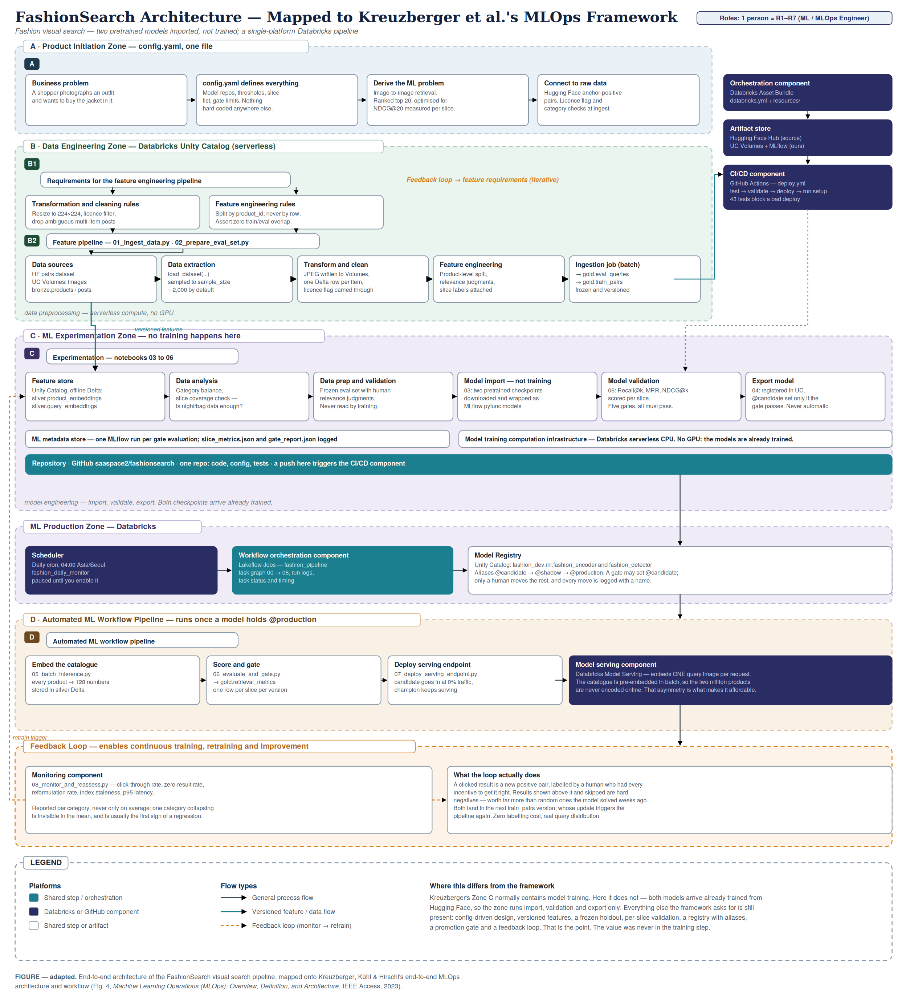
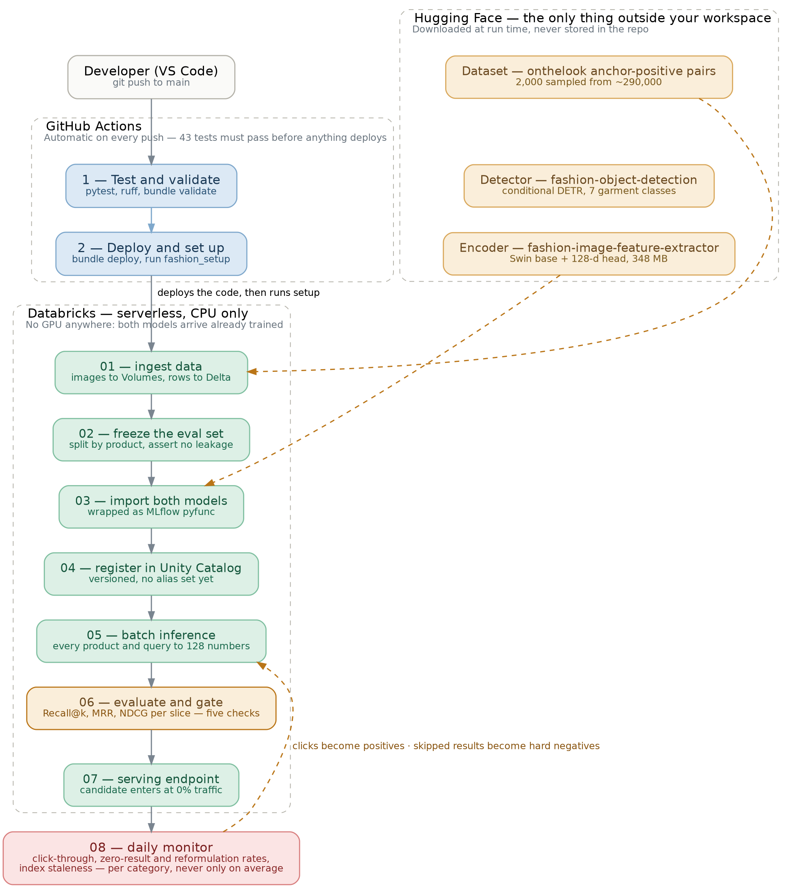

# FashionSearch 2026 — architecture

Two diagrams. Sources are in `diagrams/` so you can edit and regenerate them.

---

## 1. The system, mapped to the MLOps framework

Zones follow Kreuzberger, Kühl & Hirschl (*MLOps: Overview, Definition, and
Architecture*, IEEE Access, 2023).

**One zone reads differently from the paper, deliberately.** Zone C normally
contains model training. Here it does not — both checkpoints arrive already
trained from Hugging Face, so the zone runs import, validation and export only.

Everything else the framework asks for is still present: config-driven design,
versioned features, a frozen holdout, per-slice validation, a registry with
aliases, a promotion gate, a feedback loop. That is the point of the diagram —
the value was never in the training step.

The other structural note: this is a single-platform pipeline. Hugging Face
appears in the artifact store as a *source*, not a compute platform. No GPU is
used anywhere, because nothing is trained.

---

## 2. The workflow, from push to production

`git push` → GitHub Actions runs 43 tests, validates the bundle, deploys it, and
runs `fashion_setup`. The full pipeline (01–06) is opt-in from the Actions tab,
because it downloads 348 MB and embeds thousands of images.

The feedback arrow returns to **05**, not 01. Clicks do not produce new images —
they produce new labelled pairs over products already in the catalogue.

---

## 3. The two models

| | Model | Hugging Face repo | What it does |
|---|---|---|---|
| 1 | Detector | `yainage90/fashion-object-detection` | Conditional DETR + ResNet-50. Finds garments, 7 categories. |
| 2 | Encoder | `yainage90/fashion-image-feature-extractor` | Swin-base + a 128-unit head. Image → 128 numbers. |

They are chained: the detector says *where*, the encoder says *which one*.

### Data flow

Catalogue images go **straight to the encoder** — a shop thumbnail is already one
product on a plain background, so detection would crop it to itself. Only the
messy query side needs finding first.

Both lanes then pass through **the same encoder weights**. This is a requirement,
not an optimisation: the premise is that a query vector lands near the matching
product vector, which is only true if one model produced both.

That has a consequence worth remembering. **Retraining the encoder invalidates
every stored embedding at once**, so the whole catalogue must be re-embedded
before search works again. This is why `05_batch_inference.py` runs off the model
alias rather than a schedule.

The crop step does double duty: the box's area fraction becomes the `size_band`
slice label, which lets the gate score small items separately.

### Control flow

| Stage | When it cannot do its job |
|---|---|
| 02 · freeze eval set | Train/eval overlap → **assert fails, pipeline stops.** A leaking split inflates every downstream number, which is worse than a crash. |
| 05 · batch inference | Detector finds nothing → **embed the whole image, continue.** Screenshots and flat-lays defeat detection routinely. The eval set goes through the same fallback, so scores are honest. |
| 06 · evaluate and gate | Any of five checks fails → **raise, tag FAILED, set no alias.** The model stays in the registry with its per-slice scorecard so you can see what regressed. |
| 08 · monitor | High-severity alert → **fail the job.** A log entry is something nobody reads; a red job is something somebody notices. |

The rule behind all four: stop when continuing would produce something that looks
more trustworthy than it is. A missing detection produces a worse answer that is
honestly measured as worse, so it carries on.

**One hard exception:** the category filter is never relaxed. Returning shoes for
a jacket query is not a degraded result, it is a broken one.

---

## 4. Seeing it work

`notebooks/09_try_a_search.py` runs real queries and shows the photo next to the
top results, correct answers outlined in green. Metrics tell you Recall@20 is
0.83; this tells you what that looks like.

Run it after the pipeline. It is read-only and safe to re-run.
